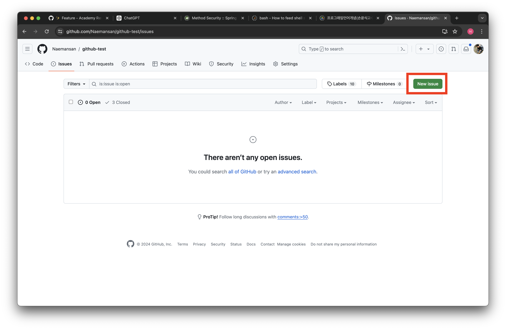
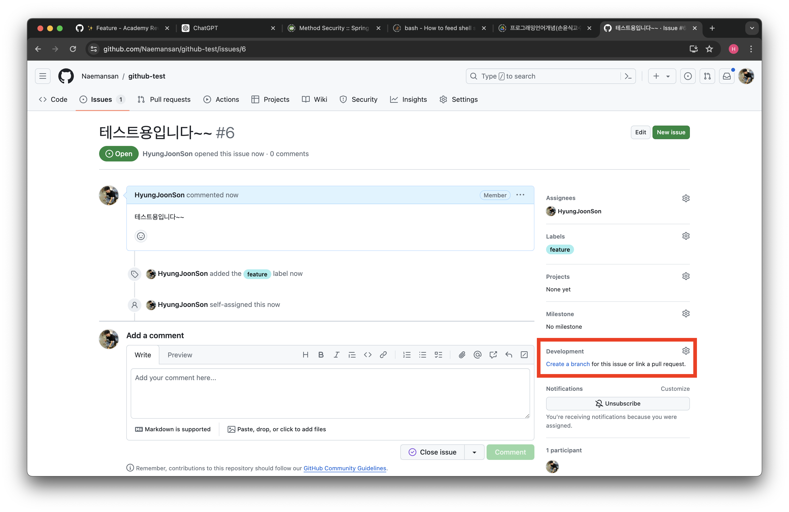
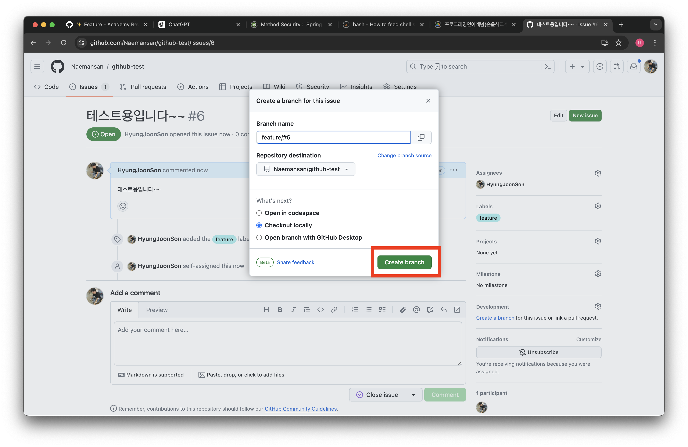
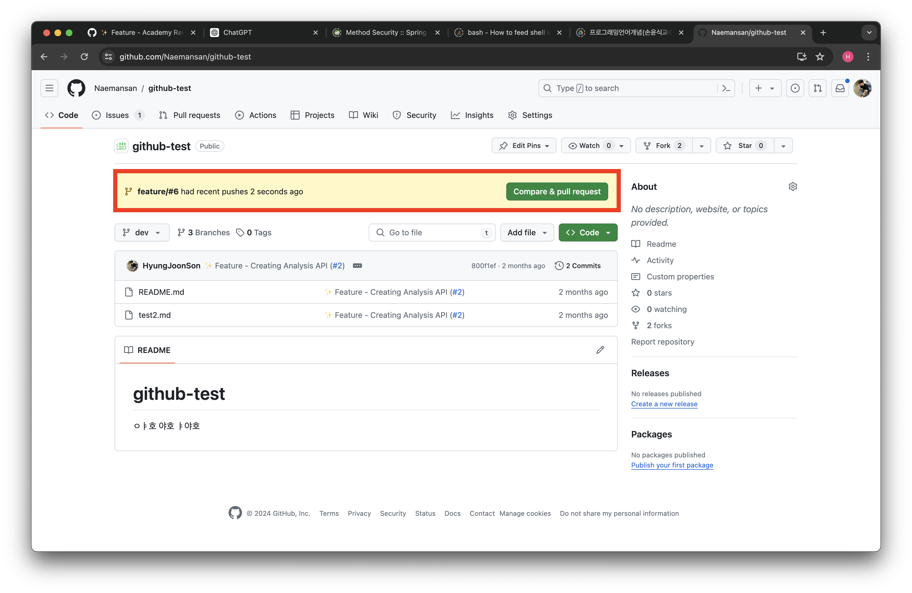
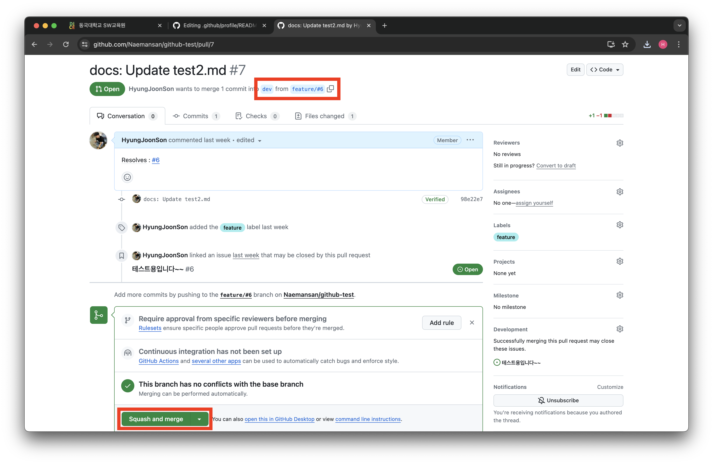
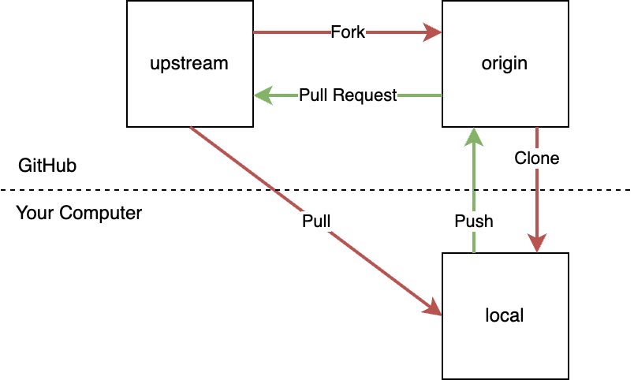
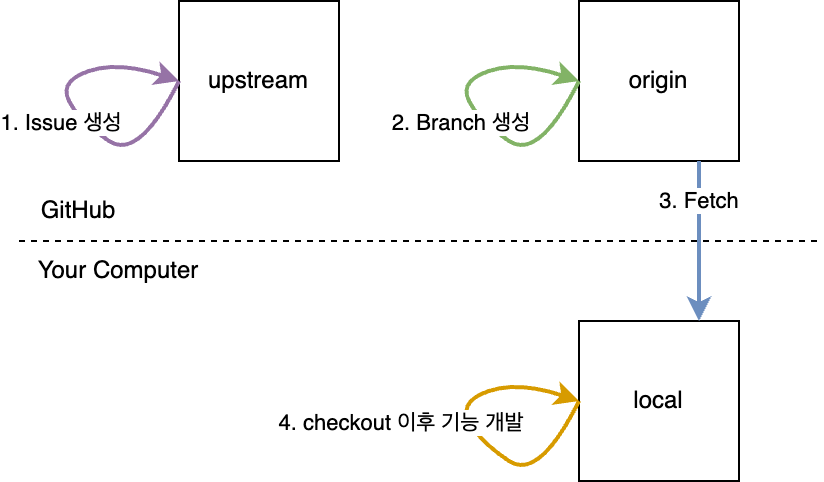
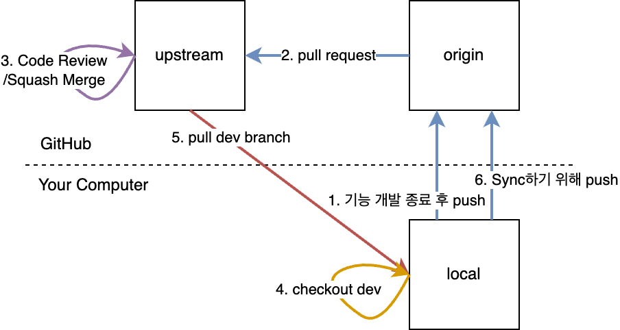

<div align="center">
</div>

# GitHub Role
해당 Repository는 다음과 같은 규칙을 따르고 있습니다.

<br/><br/>

## GitHub Branch(내부 개발자 전용)

### 개발을 시작할 때

1. 개발을 시작할 때는 현재(Origin) Repository에서 Issue를 생성합니다.
   

2. 이후 Issue에서 Origin Repository의 Dev Branch에서 새로운 Branch를 생성합니다. **오른쪽 아래에 `Create a Branch`를 통해서 생성합니다!!**
   

   - 이때 브랜치 이름은 다음을 따릅니다.
     - **새로운 기능 개발 : feature/#[Issue의 번호]**
     - **버그 픽스 : fix/#[Issue의 번호]**
     - **기능 리팩토링 : refactor/#[Issue의 번호]**

   

3. Loacl에서 Fetch를 통해 만든 New Branch(feature or fix or refactor)을 들고옵니다.

```Shell
git fetch origin
```

4. 해당 Branch로 checkout 이후 기능 개발을 진행합니다.

```Shell
git checkout feature/#1 # 예시입니다.
```

### 개발을 종료할 때

1. 기능 개발이 종료되면 현재(Origin) Repository의 Branch(feature or fix or refactor)로 변경 사항을 Push 합니다.

```Shell
git push origin feature/#1 # 예시입니다.
```

2. 위에 보이는 Compare & Pull Request 버튼을 누릅니다!
   
3. Code Review 이후 마지막으로 Approve한 사람은 `Dev`로 `Squash And Merge`를 해줍니다.
   
4. PR이 `Merge`되면 Local에서는 dev Branch로 checkout합니다.

```Shell
git checkout dev
```

5. Local에서 현재(Origin) Repository의 dev Branch를 pull 받습니다.

```Shell
git pull origin dev
```
<br/><br/>

## GitHub Branch(외부 개발자 전용)
### Flow Strategy


- 사용자는 먼저 Upstream Repository를 자신의 GitHub 계정으로 포크(fork)하고, 이 포크(fork)된 Origin Repository를 로컬 컴퓨터로 **Clone**하여 작업합니다.

- 그 후 개발한 변경 사항을 Origin Repository로 **Push**합니다. 이후 Upstream Repository로 풀 **PR**를 보내 변경 사항을 제안합니다.

- PR이 완료 된 후 Upstream Repository의 최신 변경 사항을 가져오기 위해 Local에서 풀(pull)을 사용합니다.

### 개발을 시작할 때


1. 개발을 시작할 때는 Upstream Repository에서 Issue를 생성합니다.
2. 이후 Issue에서 Origin Repository의 Dev Branch에서 새로운 Branch를 생성합니다
    - 이때 브랜치 이름은 다음을 따릅니다.
    - **새로운 기능 개발 : feature/#[Issue의 번호]**
    - **버그 픽스 : fix/#[Issue의 번호]**
    - **기능 리팩토링 : refactor/#[Issue의 번호]**
3. Loacl에서 Fetch를 통해 만든 New Branch(feature or fix or refactor)을 들고옵니다.
4. 해당 Branch로 checkout 이후 기능 개발을 진행합니다.

### 개발을 종료할 때 


1. 기능 개발이 종료되면 Origin Repository의 Branch(feature or fix or refactor)로 변경 사항을 Push 합니다.
2. Origin Repository에서 Upstream Repository로 PR을 보냅니다.
3. Code Review 이후 마지막으로 Approve한 사람은 ***Squash And Merge***를 합니다.
4. PR이 ***Squash And Merge***되면 Local에서는 dev Branch로 checkout합니다.
5. Local에서 Upstream Repository의 dev Branch를 pull 받습니다.
6. 마지막으로 Origin Repository의 dev Branch를 Update하기 위해 Push를 해줍니다.

<br/><br/>

## Branch Naming Convention
| Commit Type | Description  |
|-------------|--------------|
| main        | 테스트 완료 후 배포용 |
| release     | QA/A/B 테스트용    |
| develop     | 개발 커밋 통합용    |
| feat        | 기능 개발용       |
| fix         | 버그 수정용       |
| refactor    | 코드 리팩토링      |

<br/><br/>

## Commit Convention
| Commit Type | Description |
| --- | --- |
| feat | Add new features |
| fix | Fix bugs |
| docs | Modify documentation |
| style | Code formatting, missing semicolons, no changes to the code itself |
| refactor | Code refactoring |
| test | Add test code, refactor test code |
| chore | Modify package manager, and other miscellaneous changes (e.g., .gitignore) |
| design | Change user UI design, such as CSS |
| comment | Add or modify necessary comments |
| rename | Only changes to file or folder names or locations |
| remove | Only performing the action of deleting files |

<br/><br/>

## PR Convention
| Icon | Code                       | Description                       |
|------|----------------------------|-----------------------------------|
| 🎨   | :art                       | Improve code structure/formatting |
| ⚡️   | :zap                       | Performance improvement           |
| 🔥   | :fire                      | Delete code/files                 |
| 🐛   | :bug                       | Fix bugs                          |
| 🚑   | :ambulance                 | Urgent fixes                      |
| ✨    | :sparkles                  | Introduce new features            |
| 💄   | :lipstick                  | Add/modify UI/style files         |
